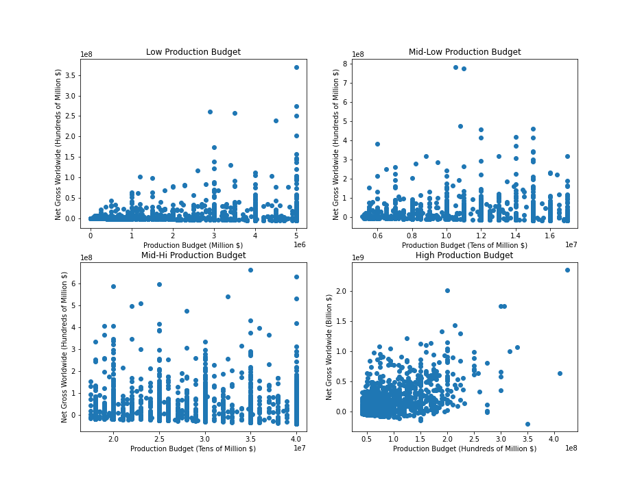

# Jumpstarting Microsoft's New Film Department
***

**Author**: Dominic Garcia

## Description
***

In this project, an analysis of movie data is conducted in order to help Microsoft ensure that their new movie making venture is both financially succesful and well-received by viewers.

## Data
***

This project's data comes from the following resources. All data can be found in the project repository's zippedData folder. 

* [IMDB](https://www.imdb.com/)
* [The Numbers](https://www.the-numbers.com/)
* [Rotten Tomatoes](https://www.rottentomatoes.com/)

## Key Findings & Business Recommendations
***

### Which genres have the best return on investment?

I identified a few genres that seemed to bring in the biggest earnings relative to their typical production budget. This involved calculating the global net earnings and ROI % for each film. The data I used here came from IMDB & The Numbers. 

This boxplot helped identify which genres performed especially well. I decided to narrow my scope to just the Action, Adventure, Comedy and Horror genres, which seemed to perform especially well and had lots of films in each style.

Looking at the trends below, there appears to be an overall decline in profitability over the last couple of years, possibly due to increases in streaming. Before the collective drop off, however, all of the genres except for Adventure show a positive trend over the course of the decade.

**Recommendations**

* Focus on making movies primarily in the genres of Action, Comedy & Horror
* The safest bet in terms of profitability seems to be an Action film
* Horror movies have great earning potential. But the ROI can also be quite erratic for horror movies, so don't count on such films for steady box office success.

### Does a film's budget determine its relative financial gain?

I closely inspected the collection of movie budgets in the **movie_budgets_df** DataFrame. This led to me to the realization that the collection was too skewed to make a reasonable analysis across the entire collection. The data for this section comes from The Numbers.

My response was to split the budgets into four distinct categories based on quantile values: Low Budget (0-5Million USD), Medium-Low Budget (5-17Million USD), Medium-High Budget (17-40Million USD) & High Budget (40Million+ USD). 

I also combed through all of the ROI percentages to detect and remove any outlying values. This was a preempitve move to make sure that none of the plots were thrown off by abnormalities. 

Then I was ready to plot production budget vs. ROI % for each of the four categories.

From the above plots, it looks as though only high budget films have a positive correlation between budget and ROI %. But looking at percentages might not give a complete picture, since the measure is relative. It might be difficult to compare, for instance, a 7000% ROI for a medium-low budget film to a 1500% ROI for a high budget film. 

I decided to create similar plots, this time inspecting a more concrete measure like global net gross (in USD) instead of the more relative ROI % measure. 

These plots have slight changes in how they look, but overall they cement my conclusion from the previous plots: movies with high production budgets have by far the most reliable, positive correlation between their budgets and the money they net. 

**Recommendations**

* Guarantee a dependable relationship between money put into a film and financial gain by making movies with production budgets of $40 million or more. 
* Normally, this would be an immense (and probably unfeasable) task for a new studio, but given Microsoft's financial status, the company is uniquely able to follow through on this advice. 

### Do movies with certain runtimes perform best with audiences and critics?

After pinpointing a couple of methods for certifying box office success, I moved my focus toward successful audience and critic response. 

Good critic scores and a fervent fanbase usually lead to more movie purchases in the long run. Additionally, these positive responses are more likely spark consumer interest in supplementary income streams like merchandising.

I began this section by merging both dataframes from IMDB into the new **ratings_basics_df**. Afterwards, I created quantile-based categories for the number of audience votes behind a film's rating: Low Votes (0-16), Medium-Low Votes (16-62), Medium-High Votes (62-353) & High Votes (353+). This was so that I could hue my plot of runtime vs. rating by the number of votes.

Clearly, including all films in the graph for the sake of comparing between vote counts introduced too much noise. This led me to plot runtime vs. audience rating for movies with a high vote count, the category closest to representing true audience response. 

This new regression plot showed a positive correlation between runtime and audience rating. Furthermore, the runtime range that exhibits tightly-clustered positive scores (above 5/10) and relatively low amounts of poor ratings was between 100 & 120 minutes. 

Next, I looked at critic responses and how they relate to a movie's runtime using data from Rotten Tomatoes. This involved cleaning and standardizing the collection of scores (a jumbled mess of letter grades and fraction scores with varying denominators, among other types) so that all scores were numerical and measured out of 100. 

The Rotten Tomatoes regression plot seemed more difficult to interpret at first glance, since each movie could have multiple scores associated with it. 

But inspecting it more closely helped solidify and expand on my previous finding: there is tight clustering of positive critic scores for films between 80 & 140 minutes long, and there is a noticeable drop off in negative scores for films between 120 & 140 minutes long. 

Since the first regression plot showed a more tangible correlation between variables, I settled on the runtime suggested there: between 100 & 120 minutes. 

**Recommendations**

* Gain a better chance at more long term income streams per movie made by putting effort toward receiving positive responses among viewers and critics. 
* Make movies that run between 100 & 120 minutes long to better ensure positive responses among these groups.
* If undecided between making a movie's runtime shorter or longer than the current one, err towards making the movie longer. Data from IMDB and Rotten Tomatoes both suggest (to varying degrees) a positive correlation between runtime and reception, and Rotten Tomatoes' data suggests that even movies between 120 & 140 minutes long perform well with critics. 

## Next Steps
***

Given the necessary time, additional analysis could provide insight on questions such as:

* **Which experienced studios could Microsoft benefit from a partnership with?**
* **Which screenwriters make the most profitable scripts?**
* **Which release months or seasons are best for a film's financial performance?**

## For More Information
***

You can find more in-depth analysis in the [Jupyter Notebook](https://github.com/dl-gd/flatiron-phase-1-project/blob/master/MicrosoftFilmStudio.ipynb), or get a cursory review through this [presentation](https://github.com/dl-gd/flatiron-phase-1-project/blob/master/MicrosoftFilmPresentation.pdf).

For additional info, contact Dominic Garcia at dlgarcia.017@gmail.com

## Repository Structure
***
├── .ipynb_checkpoints
├── images
├── zippedData
├── .DS_Store
├── MicrosoftFilmPresentation.pdf
├── MicrosoftFilmNotebook.pdf
├── MicrosoftFilmStudio.ipynb
└── README.md